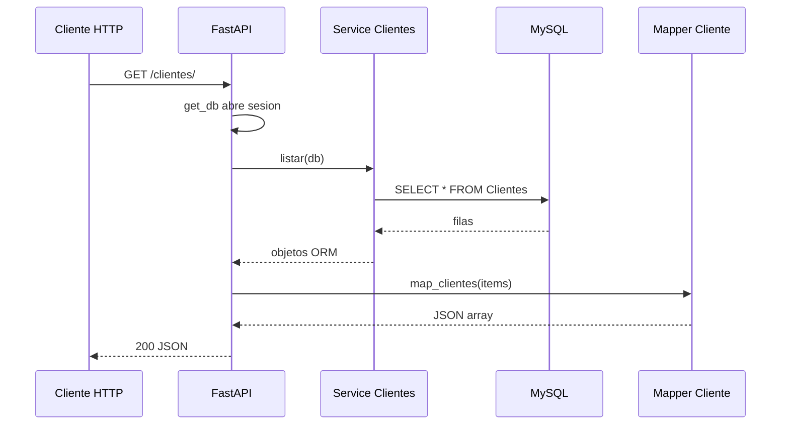

# API Clientes

## Endpoints
- GET /clientes/ — lista todos los clientes
- GET /clientes/{id_cliente} — obtiene un cliente
- POST /clientes/ — crea un cliente
- PUT /clientes/{id_cliente} — actualiza un cliente
- DELETE /clientes/{id_cliente} — elimina un cliente



## Ejemplos de Cuerpo para POST/PUT
```json
{
  "id_cliente": "10000021",
  "nombre": "Nuevo Cliente",
  "telefono": "3001234567",
  "direccion": "Calle X #Y-Z"
}
```
