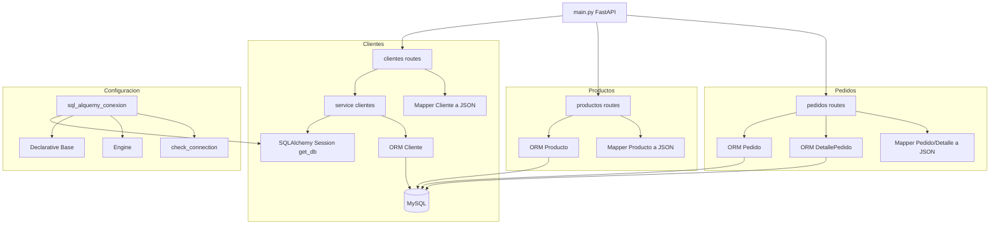

# Arquitectura del Proyecto

## Descripción
- Enrutamiento en main.py incluye módulos clientes, productos y pedidos.
- Cada módulo separa la lógica de negocio en service, usando SQLAlchemy y el engine configurado.
- Los mappers convierten objetos ORM a JSON seguro y consistente para las respuestas HTTP.
- La base de datos MySQL se consume sin creación de tablas (ya existentes). 
