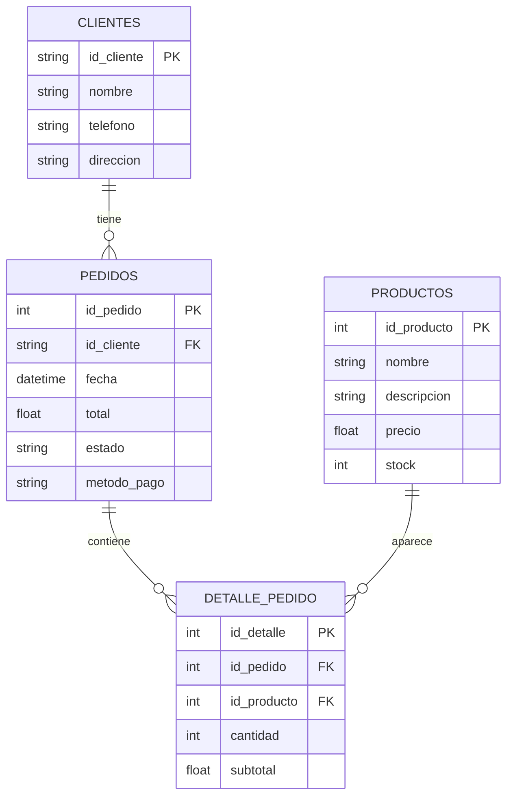

# Esquema de Base de Datos

## Notas
- El campo precio_unitario se eliminó de DetallePedido; se usa subtotal.
- Restricciones: ON DELETE CASCADE en relación Pedidos -> DetallePedido y Clientes -> Pedidos. 
